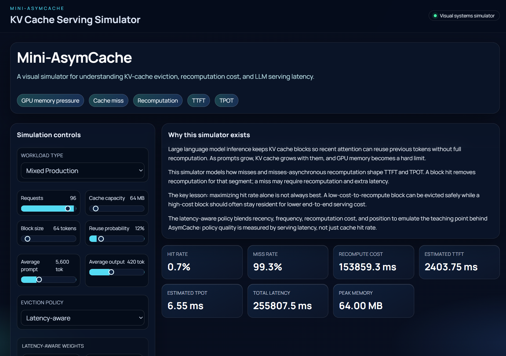
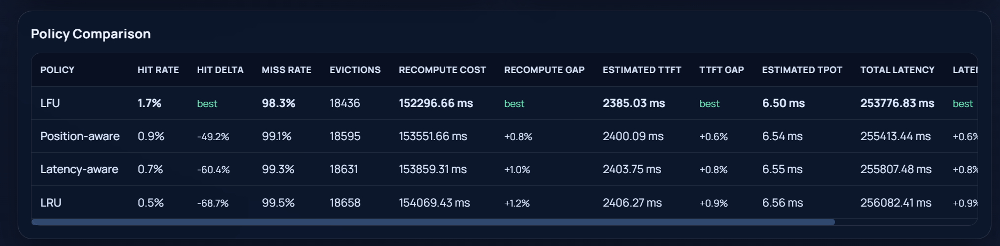
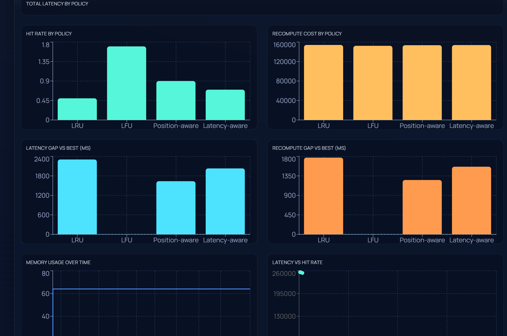
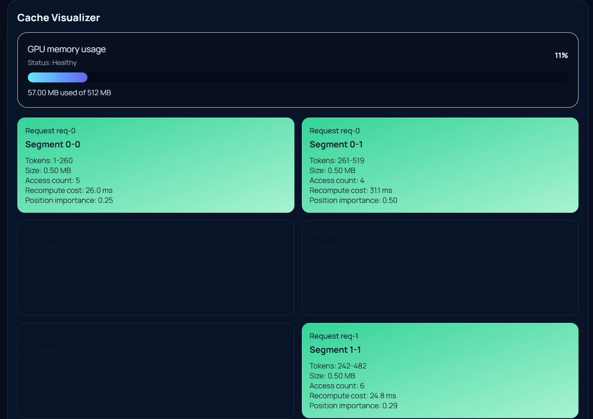

# Mini-AsymCache









**Mini-AsymCache** is a visual, browser-based simulator for understanding how KV-cache eviction decisions affect LLM serving latency.

It is inspired by the paper **“Multi-Segment Attention: Enabling Efficient KV-Cache Management for Faster Large Language Model Serving”**, which introduces AsymCache as a computation-latency-aware KV-cache management system.

This project does **not** reproduce the paper’s GPU kernels or benchmark results. Instead, it turns the core systems idea into an interactive simulator:

> The best cache policy is not always the one with the highest hit rate.
> In LLM serving, recomputation cost, memory pressure, token position, and latency all matter.

---

## Why this exists

LLM inference is often discussed at the model level: architecture, parameters, context length, and benchmarks.

But serving LLMs efficiently is also a systems problem.

As context windows grow, the KV cache can become a major memory bottleneck. When memory pressure forces cache eviction, future requests may need recomputation. That recomputation can affect:

* **TTFT** — time to first token
* **TPOT** — time per output token
* total request latency
* memory utilization
* serving cost

Mini-AsymCache makes those tradeoffs visible.

---

## What the simulator shows

The app lets you simulate synthetic LLM-style request streams and compare cache eviction strategies side by side.

Supported policies:

* **LRU** — evict the least recently used block
* **LFU** — evict the least frequently used block
* **Position-aware** — use segment position importance in eviction decisions
* **Latency-aware** — use a weighted score over recency, frequency, recomputation cost, and position importance

The latency-aware policy exposes tunable weights:

* `alpha` — recency
* `beta` — frequency
* `gamma` — recomputation cost
* `delta` — position importance

---

## Core simulator flow

```text
Synthetic requests
      ↓
Prompt split into cache segments
      ↓
KV blocks inserted / reused / evicted
      ↓
Policy decisions create HIT, MISS, INSERT, EVICT, RECOMPUTE events
      ↓
Simulator estimates TTFT, TPOT, recomputation cost, and total latency
      ↓
Dashboard compares policies visually
```

---

## Features

* Visual GPU KV-cache memory display
* Animated cache blocks
* Hit / miss / insert / evict / recompute event timeline
* Policy comparison table
* TTFT and TPOT estimates
* Recompute cost tracking
* Memory pressure visualization
* Workload presets:

  * Short Chat
  * Long Context
  * Mixed Production
* Recharts-based visual analytics
* React + TypeScript implementation
* Vitest tests for simulator behavior

---

## Tech stack

* React
* TypeScript
* Vite
* Tailwind CSS
* Framer Motion
* Recharts
* Vitest

---

## Local setup

```bash
npm install
npm run dev
```

Then open:

```text
http://localhost:5173/
```

Run tests:

```bash
npm test
```

Build production assets:

```bash
npm run build
```

Preview production build:

```bash
npm run preview
```

---

## Repository layout

```text
mini-asymcache/
  articles/
    linkedin_post.md
    medium_draft.md

  docs/
    paper_notes.md

  src/
    components/
      ArchitectureDiagram.tsx
      CacheVisualizer.tsx
      ChartsPanel.tsx
      ControlPanel.tsx
      ExplanationPanel.tsx
      Header.tsx
      InsightsPanel.tsx
      MetricsCards.tsx
      PolicyComparisonTable.tsx
      RequestTimeline.tsx

    simulator/
      cache.ts
      engine.ts
      metrics.ts
      policies.ts
      presets.ts
      types.ts
      workload.ts

    styles/
      index.css

    App.tsx
    main.tsx

  tests/
    policies.test.ts

  README.md
  package.json
```

---

## What is modeled

Mini-AsymCache models KV-cache behavior using simplified educational assumptions.

The simulator includes:

* synthetic request generation
* configurable prompt and output lengths
* context segmentation
* cache block creation
* cache hits and misses
* eviction decisions
* recomputation cost estimates
* memory utilization estimates
* TTFT / TPOT style latency estimates

---

## What is not modeled

This project does **not** implement:

* real CUDA kernels
* real Multi-Segment Attention kernels
* production GPU attention scheduling
* vLLM or TensorRT-LLM integration
* real model checkpoint execution
* real GPU profiling
* exact AsymCache benchmark reproduction

The numbers shown by the dashboard are simulation-based estimates. They are useful for reasoning about tradeoffs, not for claiming real serving speedups.

---

## Why hit rate is not enough

A cache policy can have a strong hit rate but still make poor serving decisions.

For example:

* it may keep cheap-to-recompute blocks
* it may evict expensive blocks
* it may ignore token position effects
* it may reduce misses but increase recomputation cost
* it may look good on average but hurt TTFT or TPOT under memory pressure

Mini-AsymCache is built around this idea: cache quality should be evaluated by serving cost, not hit rate alone.

---

## Example learning questions

Use the dashboard to explore:

* When does LRU perform well?
* When does LFU retain stale blocks?
* How does long-context workload shape change memory pressure?
* Can the highest-hit-rate policy still lose on total latency?
* How do recomputation cost and position importance affect eviction quality?
* What happens when GPU KV-cache capacity is reduced?
* How do alpha, beta, gamma, and delta change latency-aware policy behavior?

---

## Project disclaimer

This project is an educational simulator inspired by recent KV-cache management research.

It is **not** a full reproduction of AsymCache and does not implement custom GPU kernels, production attention kernels, or real LLM serving internals.

The goal is to make the systems tradeoff visible and easier to reason about.

---

## Future improvements

Potential next steps:

* Add side-by-side event replay for all policies
* Add per-request priority classes
* Add calibrated latency profiles from real serving traces
* Add workload import/export as JSON
* Add token-level reuse visualization
* Add CI workflow for tests and build
* Add screenshots and a hosted demo link
* Review score direction for position-aware and latency-aware eviction logic

---

## Writing assets

The repository includes drafts for communication:

* `articles/linkedin_post.md`
* `articles/medium_draft.md`

These explain the project from an AI systems engineering perspective.
